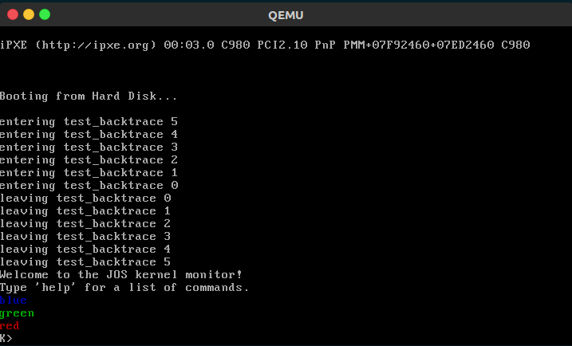

# Report for lab1, Houmin Wei


## Environment Configuration

```
Hardware Environment:
Memory:         8GB
Processor:      Intel® Core™ i5-3230M CPU @ 2.60GHz × 4
Graphics:       Intel® Ivybridge Mobile
OS Type:        64 bit
Disk:           750GB

Software Environment:
OS:             Ubuntu 16.04 LTS(x86_64)
Gcc:            Gcc 5.4.0
Make:           GNU Make 4.1
Gdb:            GNU gdb 7.11.1

```

### Test Compiler Toolchain
```shell
$ objdump -i   # the 5th line say elf32-i386
$ gcc -m32 -print-libgcc-file-name
/usr/lib/gcc/x86_64-linux-gnu/5/32/libgcc.a
```

### QEMU Emulator
```shell
 # Clone the IAP 6.828 QEMU git repository
 $ git clone https://github.com/geofft/qemu.git -b 6.828-1.7.0
 $ cd qemu
 $ ./configure --disable-kvm --target-list="i386-softmmu x86_64-softmmu"
 $ make
 $ sudo make install
```

## PC Bootstrap

### Simulating the x86
```shell
houmin@cosmos:~/lab$ make
+ as kern/entry.S
+ cc kern/entrypgdir.c
+ cc kern/init.c
+ cc kern/console.c
+ cc kern/monitor.c
+ cc kern/printf.c
+ cc kern/kdebug.c
+ cc lib/printfmt.c
+ cc lib/readline.c
+ cc lib/string.c
+ ld obj/kern/kernel
+ as boot/boot.S
+ cc -Os boot/main.c
+ ld boot/boot
boot block is 390 bytes (max 510)
+ mk obj/kern/kernel.img
```
After compiling, we now have our boot loader(obj/boot/boot) and out kernel(obj/kern/kernel), So where is the disk?
Actually the `kernel.img` is the disk image, which is acting as the virtual disk here. From kern/Makefrag we can see that
both our boot loader and kernel have been written to the image(using the `dd` command).

Now we can running the QEMU like running a real PC.
```shell
houmin@cosmos:~/lab$ make qemu
sed "s/localhost:1234/localhost:26000/" < .gdbinit.tmpl > .gdbinit
qemu -hda obj/kern/kernel.img -serial mon:stdio -gdb tcp::26000 -D qemu.log
WARNING: Image format was not specified for 'obj/kern/kernel.img' and probing guessed raw.
         Automatically detecting the format is dangerous for raw images, write operations on block 0 will be restricted.
         Specify the 'raw' format explicitly to remove the restrictions.
6828 decimal is XXX octal!
entering test_backtrace 5
entering test_backtrace 4
entering test_backtrace 3
entering test_backtrace 2
entering test_backtrace 1
entering test_backtrace 0
leaving test_backtrace 0
leaving test_backtrace 1
leaving test_backtrace 2
leaving test_backtrace 3
leaving test_backtrace 4
leaving test_backtrace 5
Welcome to the JOS kernel monitor!
Type 'help' for a list of commands.
K>
```

### The PC's Physical Address Space

```
                    +------------------+  <- 0xFFFFFFFF (4GB)
                    |      32-bit      |
                    |  memory mapped   |
                    |     devices      |
                    |                  |
                    /\/\/\/\/\/\/\/\/\/\

                    /\/\/\/\/\/\/\/\/\/\
                    |                  |
                    |      Unused      |
                    |                  |
                    +------------------+  <- depends on amount of RAM
                    |                  |
                    |                  |
                    | Extended Memory  |
                    |                  |
                    |                  |
                    +------------------+  <- 0x00100000 (1MB)
                    |     BIOS ROM     |
                    +------------------+  <- 0x000F0000 (960KB)
                    |  16-bit devices, |
                    |  expansion ROMs  |
                    +------------------+  <- 0x000C0000 (768KB)
                    |   VGA Display    |
                    +------------------+  <- 0x000A0000 (640KB)
                    |                  |
                    |    Low Memory    |
                    |                  |
                    +------------------+  <- 0x00000000
```

### The ROM BIOS
```
[f000:fff0] 0xffff0:	ljmp   $0xf000,$0xe05b
```
With GDB, we know `ljmp` the first instruction to be executed after power-up, i.e.

- The IBM PC starts executing at physical address 0x000ffff0, which is at the very top of the 64KB area reserved for the ROM BIOS.
- The PC starts executing with CS = 0xf000 and IP = 0xfff0.
- The first instruction to be executed is a jmp instruction, which jumps to the segmented address CS = 0xf000 and IP = 0xe05b.

At this time, we are still in the `real mode`, so address translation works according to the formula
```
physical address = 16 * segment + offset
```

- **What BIOS does**
  - sets up an interrupt descriptor table
  - initializes various devices such as the VGA display
  - searches for a bootable device such as a floppy, hard drive, or CD-ROM
  - when it finds a bootable disk, the BIOS reads the `boot loader` from the disk and transfers control to it

## The Boot Loader

- **What is `boot loader`**

according to [wikipedia](https://en.wikipedia.org/wiki/Booting)
>A boot loader is a computer program that loads an operating system or some other system software for the computer after completion of the power-on self-tests; it is the loader for the operating system itself. Within the hard reboot process, it runs after completion of the self-tests, then loads and runs the software.

In the conventional hard drive boot mechanism(which we use here), the boot loader(obj/boot/boot) resides in the first sector of our boot device, which we also call `boot sector`. After finishing its work, BIOS loads the 512-byte boot sector into memory at physical addresses 0x7c00 through 0x7dff, then uses a  `jmp` instruction to set the CS:IP to 0000:7c00, passing control to the boot loader.

- **Why 0x7c00**      
The magic number 0x7c00 is the result of intresesting history reasons, You can refer to [here](https://www.glamenv-septzen.net/en/view/6) .

Actually the boot loader consists of 2 source: `boot/boot.S` and `boot/main.c`

- **What boot loader does**
  - switches the processor from `real mode` to `32-bit protected mode`
  - reads the kernel from the hard disk
  - transfers control to kernel

- **Why 32-bit Protected Mode**

  In `real mode`, memory is limited to only 1MB. Valid address range from 0x00000 to 0xFFFFF, this requires a 20-bit number, which will not fit to any of 8086's 16-bit registers. Intel solved this problem by `segment:offset` pair we talked above. However, real segmented address have disadvantages:
  - A sigle segment can only refer to **64K** of memory(16 bit of offset).
    When a program has more than 64K of code, the program must be split into sections(called *segments*) and the value of CS must be changed. Similar problem occur with large amounts of data and the DS register. This can be very awkward.
  - Each byte in memory does not have an unique segmented address. The physical address 04808 can be referenced by 047C:0048, 047D:0038, 047E:0028 or 047B:0058. This can complicate the comparison of segmented addresses

  In 80286, Intel invented `16-bit protected mode`. We still use the `selector:offset` pair to realize address translation. However, the former of the pair is not called `segment` any more, it's now called `selector`. In real mode, the former value of the pair is a paragraph number of physical memory. In protected mode, a selector value is an `index` into a `descriptor table`.  In both modes, programs are divided into segments. In real mode, these segments are at fixed positions in physical memory and the selector value denotes the paragraph number of the beginning of the segment. In protected mode, the segments are not at fixed positions in physical memory. In fact, they do not have to be in memory at all!

  Protected mode uses a technique called `virtual memory`. In 16-bit protected mode, segments are moved between memory and disk as needed. All of this is done transparently by the operating system. The program does not have to be written differently for virtual memory to work.

  In protected mode, each segment is assigned an entry in a descriptor table. This entry has all the information that the system needs to know about the segment. This information includes: is it currently in memory; if in memory, where is it; access permissions (e.g., read-only). The index of the entry of the segment is the selector value that is stored in segment registers.

  One big disadvantage of 16-bit protected mode is that *offsets are still 16-bit quantities*. As a consequence of this, segment sizes are still limited to at most 64K. This makes the use of large arrays problematic!

  The 80386 introduced 32-bit protected mode. There are two major differences between 386 32-bit and 286 16-bit protected modes:
  - Offsets are expanded to be 32-bits. Thus, segments can have sizes up to 4GB.
  - Segments can be divided into smaller 4K-sized units called `pages`. The virtual memory system works with pages now instead of segments. This means that only parts of segment may be in memory at any one time. In 286 16-bit mode, either the entire segment is in memory or none of it is. This is not practical with the larger segments that 32-bit mode allows.

  The paragraphs are quoted from sections 1.2.7 and 1.2.8 [PC Assembly Language](https://pdos.csail.mit.edu/6.828/2014/readings/pcasm-book.pdf), Or you may refer to Intel architecture manuals.

- **In a word, why protected mode**       

From 8086 to 80286, Intel introduced protected mode which enable protection to memory and other peripheral device on hardware level(by `Privilege levels` and other mechanisms to restrict memory access). On the other hand, it introduced `virtual memory`, which enable independence of physical space and logic space and raises utilization of memory. While in 80386, Intel expanded offsets to 32 bits(which allow 4G memory space) and introduced  `paging`(which raises utilization of memory more!)

**Exercise 3**
---

>Q: At what point does the processor start executing 32-bit code? What exactly causes the switch from 16- to 32-bit mode?

In `boot.S`, the `ljmp $PROT_MODE_CSEG, $protcseg` causes the switch from 16- to 32-bit mode in the boot.S:
```
  lgdt    gdtdesc
  movl    %cr0, %eax
  orl     $CR0_PE_ON, %eax
  movl    %eax, %cr0
  ljmp    $PROT_MODE_CSEG, $protcseg
```

- **How ljmp works**      

To enable 32-bit protected mode, we have to prepare the GDT first(we can use the `lgdt` command), then we enable the `PE` bit on CR0.
Note that to complete the process of loading a new GDT, the segment registers need to be reloaded. The CS register must be loaded using a far jump(You can refer to [here](https://en.wikibooks.org/wiki/X86_Assembly/Global_Descriptor_Table))

For the `ljmp` instruction, In Real Address Mode or Virtual 8086 mode, the former pointer provides 16 bits for the CS register. In protected mode, the former 16-bit now works as selector. And PROT_MODE_CSEG(0x8) ensure that we still work in the same segment. The offset $protcseg is exactly the next instruction. Till now,we have switch to 32-bit mode, but we still work in the same program logic segment.

- **Why PROT_MODE_CSEG should be 0x8, PROT_MODE_DSEG should be 0x10**

0x00 points at the null selector.       
0x08 points at the code selector.       
0x10 points at the data selector.     

```
# Bootstrap GDT
.p2align 2                               # force 4 byte alignment
gdt:
  SEG_NULL                               # null seg
  SEG(STA_X|STA_R, 0x0, 0xffffffff)      # code seg
  SEG(STA_W, 0x0, 0xffffffff)            # data seg

gdtdesc:
  .word   0x17                           # sizeof(gdt) - 1
  .long   gdt                            # address gdt
```
Actually, null segment, code segment and data segment all start at 0x0, their limit are 0xffffffff(4G).


- **Question: Before enabling protected mode, we are still at 16-bit real mode, why can we use 32-bit register eax?**


>Q: What is the last instruction of the boot loader executed

In `main.c`, it's
```c
((void (*)(void)) (ELFHDR->e_entry))();
```

in `obj/boot/boot.asm`, it's
```
7d6b:   ff 15 18 00 01 00       call   *0x10018
```
After this instruction, the boot loader transfers control to the kernel.

>Q: and what is the first instruction of the kernel it just loaded?

In `entry.S`, it's
```
movw    $0x1234,0x472           # warm boot
```

In `obj/kern/kernel.asm`, it's
```
f010000c:   66 c7 05 72 04 00 00    movw   $0x1234,0x472
```

>Q: Where is the first instruction of the kernel?

Since the last instruction the boot loader executed is `call *0x10018`, the first instruction of the kernel should be at `*0x10018`. Examine `*0x10018` using gdb:
```
(gdb) x/1x 0x10018
0x10018:	0x0010000c
```

>Q: How does the boot loader decide how many sectors it must read in order to fetch the entire kernel from disk? Where does it find this information?

The boot loader read the first page(after boot sector, the kernel start at sector 1) of the disk image. Then, it reads the `program head table` to get all the program segment information. Last, it loads each of the segment to its  `ph->ppa` address. *p_pa is the load address of this segment (as well as the physical address)*
```c
     // load each program segment (ignores ph flags)
     ph = (struct Proghdr *) ((uint8_t *) ELFHDR + ELFHDR->e_phoff);
     eph = ph + ELFHDR->e_phnum;
     for (; ph < eph; ph++)
         // p_pa is the load address of this segment (as well
         // as the physical address)
         readseg(ph->p_pa, ph->p_memsz, ph->p_offset);
```


As we can see, An ELF file has two views: the program header shows the segments used at run-time, whereas the section header lists the set of sections of the binary. We now only focus on run-time view.

### Loading the Kernel

> **link address(VMA)**
The link address of a section is the memory address from which the section expects to execute.
> **load address(LMA)**
The load address of a section is the memory address at which that section should be loaded into memory.

- program header table of `obj/boot/boot.out`

```
start address 0x00007c00

Program Header:
    LOAD off    0x00000074 vaddr 0x00007c00 paddr 0x00007c00 align 2**2
         filesz 0x00000230 memsz 0x00000230 flags rwx
   STACK off    0x00000000 vaddr 0x00000000 paddr 0x00000000 align 2**4
         filesz 0x00000000 memsz 0x00000000 flags rwx
```

- program header table of `obj/kern/kernel`
```
start address 0x0010000c

Program Header:
    LOAD off    0x00001000 vaddr 0xf0100000 paddr 0x00100000 align 2**12
         filesz 0x0000712f memsz 0x0000712f flags r-x
    LOAD off    0x00009000 vaddr 0xf0108000 paddr 0x00108000 align 2**12
         filesz 0x0000a300 memsz 0x0000a944 flags rw-
   STACK off    0x00000000 vaddr 0x00000000 paddr 0x00000000 align 2**4
         filesz 0x00000000 memsz 0x00000000 flags rwx
```

we can see that for boot, the link address is the same with the load address. However, for the kernel, the link address is different with the load address.

**Exercise 5**
---

>Q: Trace through the first few instructions of the boot loader again and identify the first instruction that would "break" or otherwise do the wrong thing if you were to get the boot loader's link address wrong. Then change the link address in boot/Makefrag to something wrong, run make clean, recompile the lab with make, and trace into the boot loader again to see what happens. Don't forget to change the link address back and make clean again afterward!

we changed the boot loader's link address in boot/Makefrag from 0x7c00 t0 0x7e00 and recompile the lab. Here is the boot/boot.asm
```
00007e00 <start>:
.set CR0_PE_ON,      0x1         # protected mode enable flag

.globl start
start:
  .code16                     # Assemble for 16-bit mode
  cli                         # Disable interrupts
    7e00:	fa                   	cli    
  cld                         # String operations increment
    7e01:	fc                   	cld    

  # Set up the important data segment registers (DS, ES, SS).
  xorw    %ax,%ax             # Segment number zero
    7e02:	31 c0                	xor    %eax,%eax
  movw    %ax,%ds             # -> Data Segment
    7e04:	8e d8                	mov    %eax,%ds
  movw    %ax,%es             # -> Extra Segment
    7e06:	8e c0                	mov    %eax,%es
  movw    %ax,%ss             # -> Stack Segment
    7e08:	8e d0                	mov    %eax,%ss
```
We can see that the start address of the boot have been changed to 0x7e00. But BIOS still load the boot loader to 0x7c00. We set a breakpoint at 0x7c00.
```shell
(gdb) b *0x7c00
Breakpoint 1 at 0x7c00
(gdb) c
Continuing.
[   0:7c00] => 0x7c00:	cli    

Breakpoint 1, 0x00007c00 in ?? ()
(gdb) si
[   0:7c01] => 0x7c01:	cld  
```
As we can see, since BIOS still load the boot loader to 0x7c00, the first few instruction still work. However, when it comes to address reference at `lgdt` instruction, it would do the wrong thing.
```
(gdb) si
[   0:7c1e] => 0x7c1e:	lgdtw  0x7e64
0x00007c1e in ?? ()
(gdb) x/6xb 0x7e64
0x7e64:	0x00	0x00	0x00	0x00	0x00	0x00
(gdb) x/6xb 0x7c64
0x7c64:	0x17	0x00	0x4c	0x7e	0x00	0x00
```
As we have talked above, lgdt instruction loads the gdtdesc to GDTR. However, when we check the 6B at 0x7e64, they are all 0. But 0x7c64 shows the right value. After this instruction, we have an incorrect GDT. Continuing Stepping, we got
```
0x7c1e:	lgdtw  0x7e64
=> 0x7c23:	mov    %cr0,%eax
0x7c26:	or     $0x1,%eax
0x7c2a:	mov    %eax,%cr0
0x7c2d:	ljmp   $0x8,$0x7e32
0x7c32:	mov    $0xd88e0010,%eax
0x7c38:	mov    %ax,%es
0x7c3a:	mov    %ax,%fs
0x7c3c:	mov    %ax,%gs
0x7c3e:	mov    %ax,%ss
0x7c40:	mov    $0x7e00,%sp
0x7c43:	add    %al,(%bx,%si)
0x7c45:	call   0x7d13
0x7c48:	add    %al,(%bx,%si)
(gdb) si
[   0:7c26] => 0x7c26:	or     $0x1,%eax
0x00007c26 in ?? ()
(gdb) si
[   0:7c2a] => 0x7c2a:	mov    %eax,%cr0
0x00007c2a in ?? ()
(gdb) si
[   0:7c2d] => 0x7c2d:	ljmp   $0x8,$0x7e32
0x00007c2d in ?? ()
(gdb) si
[f000:e05b]    0xfe05b:	cmpl   $0x0,%cs:0x6c48
0x0000e05b in ?? ()
(gdb) si
[f000:e062]    0xfe062:	jne    0xfd2e1
```
After the `ljmp   $0x8,$0x7e32`, things go totally wrong!

**Exercise 6**
---

> Q: Examine the 8 words of memory at 0x00100000 at the point the BIOS enters the boot loader, and then again at the point the boot loader enters the kernel. Why are they different? What is there at the second breakpoint?

Before the BIOS enters the boot loader
```
(gdb) x/8x 0x100000
0x100000:	0x00000000	0x00000000	0x00000000	0x00000000
0x100010:	0x00000000	0x00000000	0x00000000	0x00000000
```

Before the boot loader enters the kernel
```
(gdb) x/8x 0x100000
0x100000:	0x1badb002	0x00000000	0xe4524ffe	0x7205c766
0x100010:	0x34000004	0x0000b812	0x220f0011	0xc0200fd8
```

Because the boot loader loads the kernel to 0x100000

## The Kernel

### Using virtual memory to work around position dependence

- **How Paging Works**

  At lab1, we map the first 4MB of physical memory using hand-written, statically-initialized page directory and page table in `kern/entrypgdir.c`.

  Up until `kern/entry.S` sets the `CR0_PG` flag, memory references are treated as physical addresses. Once CR0_PG is set, memory references are virtual addresses that get translated by the virtual memory hardware to physical addresses. `entry_pgdir` translates
  - virtual addresses 0xf0000000 through 0xf0400000 to physical addresses 0x00000000 through 0x00400000
  - virtual addresses 0x00000000 through 0x00400000 to physical addresses 0x00000000 through 0x00400000.

  Any virtual address that is not in one of these two ranges will cause a hardware exception which, since we haven't set up interrupt handling yet, will cause QEMU to dump the machine state and exit.

  Right now, each memory reference must look up to the `entry_pgdir` first. After finding its PTE index, its real physical is known.


>Q: Use QEMU and GDB to trace into the JOS kernel and stop at the movl %eax, %cr0. Examine memory at 0x00100000 and at 0xf0100000. Now, single step over that instruction using the stepi GDB command. Again, examine memory at 0x00100000 and at 0xf0100000. Make sure you understand what just happened.

```
(gdb) x/10i 0x10000c
=> 0x10000c:	movw   $0x1234,0x472
   0x100015:	mov    $0x110000,%eax
   0x10001a:	mov    %eax,%cr3
   0x10001d:	mov    %cr0,%eax
   0x100020:	or     $0x80010001,%eax
   0x100025:	mov    %eax,%cr0
   0x100028:	mov    $0xf010002f,%eax
   0x10002d:	jmp    *%eax
   0x10002f:	mov    $0x0,%ebp
   0x100034:	mov    $0xf0110000,%esp
(gdb) stepi 5
=> 0x100025:	mov    %eax,%cr0
0x00100025 in ?? ()
(gdb) x/4bx 0x00100000
0x100000:	0x02	0xb0	0xad	0x1b
(gdb) x/4bx 0xf0100000
0xf0100000 <_start+4026531828>:	0x00	0x00	0x00	0x00
(gdb) stepi
=> 0x100028:	mov    $0xf010002f,%eax
0x00100028 in ?? ()
(gdb) x/4bx 0x00100000
0x100000:	0x02	0xb0	0xad	0x1b
(gdb) x/4bx 0xf0100000
0xf0100000 <_start+4026531828>:	0x02	0xb0	0xad	0x1b
```

As we can see, Before `movl %eax, %cr0`, memory at 0x00100000 and at 0xf0100000 is different. After we `stepi`, memory at 0xf0100000 have been mapped to memory at 0x00100000.

> What is the first instruction after the new mapping is established that would fail to work properly if the mapping weren't in place? Comment out the movl %eax, %cr0 in kern/entry.S, trace into it, and see if you were right.


`jmp *%eax` would fail because `0xf010002c` is outside of RAM
```
qemu: fatal: Trying to execute code outside RAM or ROM at 0xf010002c
```

### Formatted Printing to the Console

- **How printf works**
To understand how `printf` works, we need to understand [How Variable Argument Lists Work in C](http://www.cplusplus.com/reference/cstdarg/va_start/)


**Exercise 8**
---

>Q: We have omitted a small fragment of code - the code necessary to print octal numbers using patterns of the form "%o". Find and fill in this code fragment.

Replace the original code in  
```c
// (unsigned) octal
case 'o':
  // Replace this with your code.
  putch('X', putdat);
  putch('X', putdat);
  putch('X', putdat);
  break;
```
with
```c
case 'o':
  num = getuint(&ap, lflag);
  base = 8;
  goto number;
```

Be able to answer the following questions:


> Q. Explain the interface between printf.c and console.c. Specifically, what function does console.c export? How is this function used by printf.c?

console.c exports `cputchar` `getchar` `iscons`, while `cputchar` is used as a parameter when printf.c calls `vprintfmt` in printfmt.c.

> Q. Explain the following from console.c:
```c
1      if (crt_pos >= CRT_SIZE) {
2              int i;
3              memcpy(crt_buf, crt_buf + CRT_COLS, (CRT_SIZE - CRT_COLS) * sizeof(uint16_t));
4              for (i = CRT_SIZE - CRT_COLS; i < CRT_SIZE; i++)
5                      crt_buf[i] = 0x0700 | ' ';
6              crt_pos -= CRT_COLS;
7      }
```

When the screen is full, scroll down one row to show newer infomation.

> Q. For the following questions you might wish to consult the notes for Lecture 2. These notes cover GCC's calling convention on the x86.
Trace the execution of the following code step-by-step:

```c
int x = 1, y = 3, z = 4;
cprintf("x %d, y %x, z %d\n", x, y, z);
```
  - In the call to `cprintf()`, to what does fmt point? To what does ap point?
  - List (in order of execution) each call to cons_putc, va_arg, and vcprintf. For cons_putc, list its argument as well. For va_arg, list what ap points to before and after the call. For vcprintf list the values of its two arguments.


In the call to cprintf(), fmt point to the format string of its arguments, ap points to the variable arguments after fmt.


> Q. Run the following code.

```c
    unsigned int i = 0x00646c72;
    cprintf("H%x Wo%s", 57616, &i);
```
> What is the output? Explain how this output is arrived at in the step-by-step manner of the previous exercise.

The output is `He110 World`, because 57616=0xe110, so the first half of output is He110, i=0x00646c72 is treated as a string, so it will be printed as 'r'=(char)0x72 'l'=(char)0x6c 'd'=(char)0x64, and 0x00 is treated as a mark of end of string.

> The output depends on that fact that the x86 is little-endian. If the x86 were instead big-endian what would you set i to in order to yield the same output? Would you need to change 57616 to a different value?

In order to yield the same output in big-endian, we should set i to `0x726c64`, we don't need to change 57616.

> Q. In the following code, what is going to be printed after 'y='? (note: the answer is not a specific value.) Why does this happen?

```c
    cprintf("x=%d y=%d", 3);
```

`x=3 y=SOMETHING_UNKONW`
y will be the decimal value of the 4 bytes right above where 3 is placed in the stack.

> Q. Let's say that GCC changed its calling convention so that it pushed arguments on the stack in declaration order, so that the last argument is pushed last. How would you have to change cprintf or its interface so that it would still be possible to pass it a variable number of arguments?

Push an integer after the last argument indicating the number of arguments.


***Challenge***

>Enhance the console to allow text to be printed in different colors. The traditional way to do this is to make it interpret ANSI escape sequences embedded in the text strings printed to the console, but you may use any mechanism you like. There is plenty of information on the 6.828 reference page and elsewhere on the web on programming the VGA display hardware. If you're feeling really adventurous, you could try switching the VGA hardware into a graphics mode and making the console draw text onto the graphical frame buffer.



First I create a globl variable `textcolor` under `inc/textcolor.h`, than in `lib/printfmt.c`

```
while (1) {
  while ((ch = * (unsigned char * ) fmt++) != '%') {
    if (ch == '\0')
+			{
+				textcolor = 0x0700;
      return;
+			}
    putch(ch, putdat);
  }

...

switch ...

+		// text color
+		case 'm':
+			num = getint(&ap, lflag);
+			textcolor = num;
+			break;

```

in  `kern/console.c`

```
cga_putc(int c)
{
 // if no attribute given, then use black on white
-	if (!(c & ~0xFF))
-		c |= 0x0700;
+	c |= textcolor;
+
+//	if (!(c & ~0xFF))
+//		c |= 0x0700;

 switch (c & 0xff) {
 case '\b':
```

in `kern/monitor.c`
```
cprintf("Welcome to the JOS kernel monitor!\n");
cprintf("Type 'help' for a list of commands.\n");
-
+	cprintf("%m%s\n%m%s\n%m%s\n", 0x0100, "blue", 0x0200, "green", 0x0400, "red");
```

### The Stack

**Exercise 9**
---
>Q: Determine where the kernel initializes its stack, and exactly where in memory its stack is located. How does the kernel reserve space for its stack? And at which "end" of this reserved area is the stack pointer initialized to point to?

In the `entry.S`
```
# Clear the frame pointer register (EBP)
# so that once we get into debugging C code,
# stack backtraces will be terminated properly.
movl  $0x0,%ebp     # nuke frame pointer

# Set the stack pointer
movl  $(bootstacktop),%esp

```

In obj/kern/kernel.asm
```
# Clear the frame pointer register (EBP)
# so that once we get into debugging C code,
# stack backtraces will be terminated properly.
movl	$0x0,%ebp			# nuke frame pointer
f010002f:	bd 00 00 00 00       	mov    $0x0,%ebp

# Set the stack pointer
movl	$(bootstacktop),%esp
f0100034:	bc 00 00 11 f0       	mov    $0xf0110000,%esp
```

So, the stack starts at 0xf0110000, its range is 0xf0108000-0xf0110000.

**Exercise 10**
---
>Q: To become familiar with the C calling conventions on the x86, find the address of the test_backtrace function in obj/kern/kernel.asm, set a breakpoint there, and examine what happens each time it gets called after the kernel starts. How many 32-bit words does each recursive nesting level of test_backtrace push on the stack, and what are those words?
Note that, for this exercise to work properly, you should be using the patched version of QEMU available on the tools page or on Athena. Otherwise, you'll have to manually translate all breakpoint and memory addresses to linear addresses.

Before test_backtrace(5), we push the function parameter to stack, then we push the return address to stack. Above all, we are still at the caller-stack. Next, we enter C calling conventions
```
           push   %ebp
           mov    %esp,%ebp
           push   %ebx
           sub    $0xc,%esp
```
These belong to the callee-stack.

**Exercise 11**
---

>Q: Implement the backtrace function as specified above and hook this new function into the kernel monitor's command list

```
int
mon_backtrace(int argc, char **argv, struct Trapframe *tf)
{
	// Your code here.
	unsigned int *ebp = ((unsigned int*)read_ebp());
	cprintf("Stack backtrace:\n");
	while(ebp) {
		cprintf("ebp %08x ", ebp);
		cprintf("eip %08x args", ebp[1]);
		for(int i = 2; i <= 6; i++)
			cprintf(" %08x", ebp[i]);
		cprintf("\n");
		ebp = (unsigned int*)(*ebp);
	}
	return 0;
}
```

Here is the result:
```
6828 decimal is 15254 octal!
entering test_backtrace 5
entering test_backtrace 4
entering test_backtrace 3
entering test_backtrace 2
entering test_backtrace 1
entering test_backtrace 0
Stack backtrace:
ebp f010ff18 eip f010007b args 00000000 00000000 00000000 00000000 f010093f
ebp f010ff38 eip f0100068 args 00000000 00000001 f010ff78 00000000 f010093f
ebp f010ff58 eip f0100068 args 00000001 00000002 f010ff98 00000000 f010093f
ebp f010ff78 eip f0100068 args 00000002 00000003 f010ffb8 00000000 f010093f
ebp f010ff98 eip f0100068 args 00000003 00000004 00000000 00000000 00000000
ebp f010ffb8 eip f0100068 args 00000004 00000005 00000000 00010094 00010094
ebp f010ffd8 eip f01000d4 args 00000005 00001aac 00000648 00000000 00000000
ebp f010fff8 eip f010003e args 00111021 00000000 00000000 00000000 00000000
leaving test_backtrace 0
leaving test_backtrace 1
leaving test_backtrace 2
leaving test_backtrace 3
leaving test_backtrace 4
leaving test_backtrace 5
Welcome to the JOS kernel monitor!
Type 'help' for a list of commands.
blue
green
red
```
**Exercise 12**
---

>Q: Modify your stack backtrace function to display, for each eip, the function name, source file name, and line number corresponding to that eip.

In This Question, we know the eip(the return address), and we want to know which function this eip belong to, which file this function belong to. And which line this eip in the file.

To get all this info, we need get the debug info `Eipdebuginfo`, this struct stores all the information we need.
```
// Debug information about a particular instruction pointer
struct Eipdebuginfo {
	const char *eip_file;		// Source code filename for EIP
	int eip_line;			// Source code linenumber for EIP

	const char *eip_fn_name;	// Name of function containing EIP
					//  - Note: not null terminated!
	int eip_fn_namelen;		// Length of function name
	uintptr_t eip_fn_addr;		// Address of start of function
	int eip_fn_narg;		// Number of function arguments
};
```

To get this struct, we need the `debuginfo_eip(addr, info)` function. This function search the `STAB` table to Fill in the 'info' structure with information about the specified instruction address, 'addr'. The debuginfo_eip function has been given in `kdebug.c`, we just need to add this.
```c
// Your code here.
stab_binsearch(stabs, &lline, &rline, N_SLINE, addr);
info->eip_line = stabs[lline].n_desc;
```

In `monitor.c`
```
int
mon_backtrace(int argc, char **argv, struct Trapframe *tf)
{
	// Your code here.
	unsigned int *ebp = ((unsigned int*)read_ebp());
	cprintf("Stack backtrace:\n");

	while(ebp) {
		cprintf("ebp %08x ", ebp);
		cprintf("eip %08x args", ebp[1]);
		for(int i = 2; i <= 6; i++)
			cprintf(" %08x", ebp[i]);
		cprintf("\n");

		unsigned int eip = ebp[1];
		struct Eipdebuginfo info;
		debuginfo_eip(eip, &info);
		cprintf("\t%s:%d: %.*s+%d\n",
		info.eip_file, info.eip_line,
		info.eip_fn_namelen, info.eip_fn_name,
		eip-info.eip_fn_addr);

		ebp = (unsigned int*)(*ebp);
	}
	return 0;
}
```

Finally, we got this.
```
running JOS: (1.1s)
  printf: OK
  backtrace count: OK
  backtrace arguments: OK
  backtrace symbols: OK
  backtrace lines: OK
Score: 50/50
```
## This Complete The Lab.
