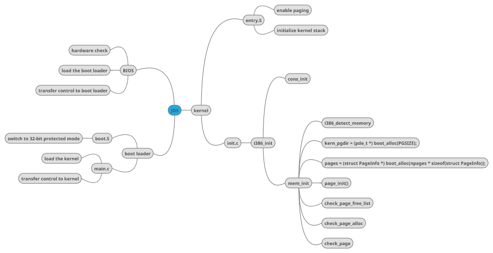
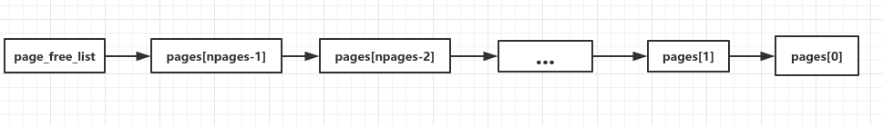

# Report for lab2, Houmin Wei
---


## Part 1: Physical Page Management


**Exercise 1**
---
>Q: You'll now write the physical page allocator. It keeps track of which pages are free with a linked list of struct PageInfo objects.

The operating system must keep track of which parts of physical RAM are free and which are currently in use. Considering what we have done now:



After the boot loader loading the kernel to physical address 0x00100000(1M, Extended Memory), the kernel began to take control. First of all, the kernel enable paging to use virtual memory and work around position dependence. During this period, we just do this using the hand-written, statically-initialized page directory and page table in `kern/entrypgdir.c`. Up to now we just map the first 4M of physical memory.
- virtual addresses 0xf0000000 through 0xf0400000 to physical addresses 0x00000000 through 0x00400000
- virtual addresses 0x00000000 through 0x00400000 to physical addresses 0x00000000 through 0x00400000

After the kernel initializing its stack, we entered `i386_init` to do some initialization work. After completing the ELF loading process, we use the `cons_init` function to realize formatted printing to the console and other works related. Finally, we enter the `mem_init` function, and this is what lab2 deal with.

It's not difficult to find that the `mem_init` in `kern/pmap.c`. In mem_init, we need to find out available base & extended memory using CMOS calls to measure(`i386_detect_memory`).
```
Physical memory: 66556K available, base = 640K, extended = 65532K
npages is 16639, npages_basemem is 160, npages_extmem is 16383
```
Since we have got physical memory information, we now can set up virtual memory and this is our virtual memory map.
```
/*
* Virtual memory map:                                Permissions
*                                                    kernel/user
*
*    4 Gig -------->  +------------------------------+
*                     |                              | RW/--
*                     ~~~~~~~~~~~~~~~~~~~~~~~~~~~~~~~~
*                     :              .               :
*                     :              .               :
*                     :              .               :
*                     |~~~~~~~~~~~~~~~~~~~~~~~~~~~~~~| RW/--
*                     |                              | RW/--
*                     |   Remapped Physical Memory   | RW/--
*                     |                              | RW/--
*    KERNBASE, ---->  +------------------------------+ 0xf0000000      --+
*    KSTACKTOP        |     CPU0's Kernel Stack      | RW/--  KSTKSIZE   |
*                     | - - - - - - - - - - - - - - -|                   |
*                     |      Invalid Memory (*)      | --/--  KSTKGAP    |
*                     +------------------------------+                   |
*                     |     CPU1's Kernel Stack      | RW/--  KSTKSIZE   |
*                     | - - - - - - - - - - - - - - -|                 PTSIZE
*                     |      Invalid Memory (*)      | --/--  KSTKGAP    |
*                     +------------------------------+                   |
*                     :              .               :                   |
*                     :              .               :                   |
*    MMIOLIM ------>  +------------------------------+ 0xefc00000      --+
*                     |       Memory-mapped I/O      | RW/--  PTSIZE
* ULIM, MMIOBASE -->  +------------------------------+ 0xef800000
*                     |  Cur. Page Table (User R-)   | R-/R-  PTSIZE
*    UVPT      ---->  +------------------------------+ 0xef400000
*                     |          RO PAGES            | R-/R-  PTSIZE
*    UPAGES    ---->  +------------------------------+ 0xef000000
*                     |           RO ENVS            | R-/R-  PTSIZE
* UTOP,UENVS ------>  +------------------------------+ 0xeec00000
* UXSTACKTOP -/       |     User Exception Stack     | RW/RW  PGSIZE
*                     +------------------------------+ 0xeebff000
*                     |       Empty Memory (*)       | --/--  PGSIZE
*    USTACKTOP  --->  +------------------------------+ 0xeebfe000
*                     |      Normal User Stack       | RW/RW  PGSIZE
*                     +------------------------------+ 0xeebfd000
*                     |                              |
*                     |                              |
*                     ~~~~~~~~~~~~~~~~~~~~~~~~~~~~~~~~
*                     .                              .
*                     .                              .
*                     .                              .
*                     |~~~~~~~~~~~~~~~~~~~~~~~~~~~~~~|
*                     |     Program Data & Heap      |
*    UTEXT -------->  +------------------------------+ 0x00800000
*    PFTEMP ------->  |       Empty Memory (*)       |        PTSIZE
*                     |                              |
*    UTEMP -------->  +------------------------------+ 0x00400000      --+
*                     |       Empty Memory (*)       |                   |
*                     | - - - - - - - - - - - - - - -|                   |
*                     |  User STAB Data (optional)   |                 PTSIZE
*    USTABDATA ---->  +------------------------------+ 0x00200000        |
*                     |       Empty Memory (*)       |                   |
*    0 ------------>  +------------------------------+                 --+
*
* (*) Note: The kernel ensures that "Invalid Memory" is *never* mapped.
*     "Empty Memory" is normally unmapped, but user programs may map pages
*     there if desired.  JOS user programs map pages temporarily at UTEMP.
*/
```

Up to now, we only mapped 4M at KERNBASE manually using `entry_pgdir` and `entry_pgtable`. From now on, we begin to remap the entire memory. First, we create initial page directory `kern_pgdir` using the `boot_alloc` function. The `boot_alloc(uint32_t n)` here behaving as a simple physical memory allocator is used only while JOS is setting up its memory system.
```c
// nextfree here is virtual address of next byte of free memory
// it is initialize to points to next free page address after the end of the kernel's bss segment:
...
if(n > 0) {
  result = nextfree;
  nextfree = ROUNDUP((char*)(nextfree+n), PGSIZE);
  if((uint32_t)nextfree - KERNBASE > (npages*PGSIZE))
    panic("Out Of Memory!\n");
//		cprintf("allocate %d bytes, update nextfree to %x\n", n, nextfree);
  return result;
}
else if(n == 0)
  return nextfree;
return NULL;
```

Next, Allocate an array of npages `struct PageInfo`s and store it in `pages`. The kernel uses this array to keep track of physical pages.
```c
//in mem_init
pages = (struct PageInfo *) boot_alloc(npages * sizeof(struct PageInfo));
memset(pages, 0, npages * sizeof(struct PageInfo));
```
we can check `struct PageInfo` in `memlayout.h`. Each PageInfo can be mapped to physical address with `page2pa()` one-to-one.
```
struct PageInfo {
	// Next page on the free list.
	struct PageInfo *pp_link;

	// pp_ref is the count of pointers (usually in page table entries)
	// to this page, for pages allocated using page_alloc.
	// Pages allocated at boot time using pmap.c's
	// boot_alloc do not have valid reference count fields.

	uint16_t pp_ref;
};

```

Now that we've allocated the initial kernel data structures, we set up the list of free physical pages. The work is done in `page_init` function. This is the initial code.
```c
size_t i;
for (i = 0; i < npages; i++) {
  pages[i].pp_ref = 0;
  pages[i].pp_link = page_free_list;
  page_free_list = &pages[i];
}
```
What we have done here is to mark all physical pages as free and realize a link list like this

However, this is not truly the case, since not all memory are free.

- Mark physical page 0 as in use. This way we preserve the real-mode IDT and BIOS structures in case we ever need them.
- The rest of base memory, [PGSIZE, npages_basemem * PGSIZE) is free.
- Then comes the IO hole [IOPHYSMEM, EXTPHYSMEM), which must never be allocated.
- Then extended memory [EXTPHYSMEM, ...). Some of it is in use, some is free. Where is the kernel  in physical memory?  Which pages are already in use for page tables and other data structures?

```c
size_t i;
page_free_list = NULL;

//num_alloc：在extmem区域已经被占用的页的个数
int num_alloc = ((uint32_t)boot_alloc(0) - KERNBASE) / PGSIZE;
//num_iohole：在io hole区域占用的页数
int num_iohole = 96;

pages[0].pp_ref = 1;
for(i = 1; i < npages_basemem; i++)
{
  pages[i].pp_ref = 0;
  pages[i].pp_link = page_free_list;
  page_free_list = &pages[i];
}

for(i = npages_basemem; i < npages_basemem + num_iohole + num_alloc; i++)
  pages[i].pp_ref = 1;
for(; i < npages; i++)
{
  pages[i].pp_ref = 0;
  pages[i].pp_link = page_free_list;
  page_free_list = &pages[i];
}
```

Then, we entered `check_page_free_list`，Check that the pages on the page_free_list are reasonable.
**Here is the code I don't quiet understand**
```c
if (only_low_memory) {
  // Move pages with lower addresses first in the free
  // list, since entry_pgdir does not map all pages.
  cprintf("before hanling low memory question, page_free_list is %x now\n", page_free_list);
  struct PageInfo *pp1, *pp2;
  struct PageInfo **tp[2] = { &pp1, &pp2 };
  for (pp = page_free_list; pp; pp = pp->pp_link) {
    int pagetype = PDX(page2pa(pp)) >= pdx_limit;
    *tp[pagetype] = pp;
    tp[pagetype] = &pp->pp_link;
  }
  *tp[1] = 0;
  *tp[0] = pp2;
  page_free_list = pp1;
}

```
As we can see, the code here is to move pages with lower address first in free list. This is because the free page list originally begins from the big-number pages. However, jos now use entry_pgdir, and have not mapped for the big-number pages. So we can only operate on small-number pages. For this reason, we need to move pages before 4M first in the free page list.

Finally, we entered `check_page_alloc`, this function checks `page_alloc` and `page_free`
```c
struct PageInfo *
page_alloc(int alloc_flags)
{
	// Fill this function in
	if(!page_free_list)
		return NULL;
	struct PageInfo *pp = page_free_list;
	if(alloc_flags & ALLOC_ZERO) {
		memset(page2kva(pp), 0, PGSIZE);
	}
	page_free_list = pp->pp_link;
	pp->pp_link = 0;
	return pp;
}

page_free(struct PageInfo *pp)
{
	// Fill this function in
	// Hint: You may want to panic if pp->pp_ref is nonzero or
	// pp->pp_link is not NULL.
	if(pp->pp_ref != 0)
		panic("pp->pp_ref is nonzero\n");
	if(pp->pp_link)
		panic("pp->pp_link is not NULL\n");

	pp->pp_link = page_free_list;
	page_free_list = pp;
}

```
Till now, we have finished Part 1.
```
Physical memory: 66556K available, base = 640K, extended = 65532K
npages is 16639, npages_basemem is 160, npages_extmem is 16383
before hanling low memory question, page_free_list is f01367f0 now
after hanling low memory question, page_free_list is f0117ff8 now
first_free_page is f0137000
nfree_basemem is 159, nfree_extmem is 16072
should be able to allocate three pages
test flags
page2kva(pp0) is f03fd000
check_page_alloc() succeeded!
```

## Part 2: Virtual Memory

### Virtual, Liner, and Physical Address

### Reference Counting

### Page Table Management

## Part 3: Kernel Address Space

### Permission and Fault Management

### Initializing the Kernel Address Space

### Address Space Layout Alternatives
