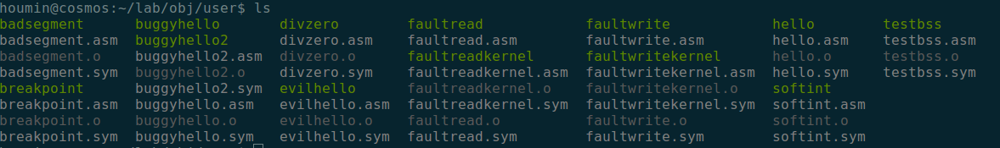
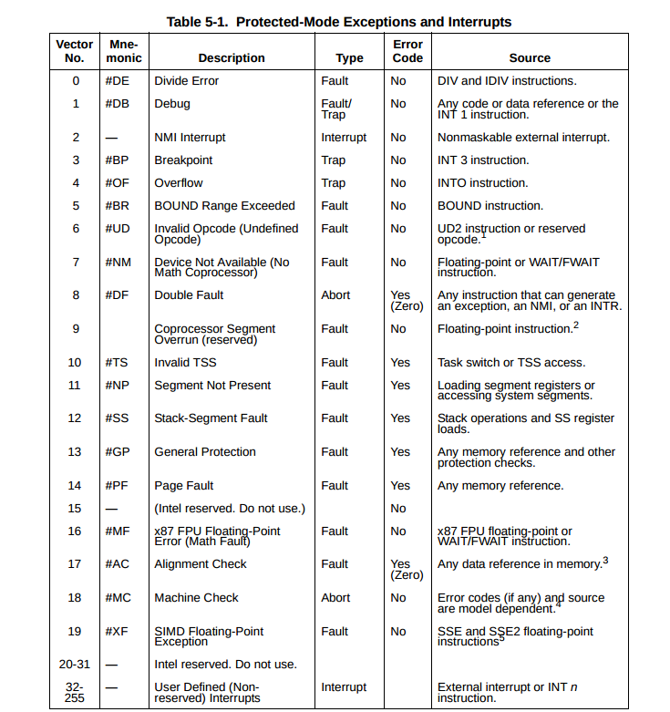

# Report for lab3, Houmin Wei

## Part A: User Environments and Exception Handling

As you can see in kern/env.c, the kernel maintains three main global variables pertaining to environments:
```c
struct Env *envs = NULL;		// All environments
struct Env *curenv = NULL;		// The current env
static struct Env *env_free_list;	// Free environment list
```
### Environment State

The Env structure is defined in inc/env.h as follows (although more fields will be added in future labs):
```c
struct Env {
	struct Trapframe env_tf;	// Saved registers
	struct Env *env_link;		// Next free Env
	envid_t env_id;			// Unique environment identifier
	envid_t env_parent_id;		// env_id of this env's parent
	enum EnvType env_type;		// Indicates special system environments
	unsigned env_status;		// Status of the environment
	uint32_t env_runs;		// Number of times environment has run

	// Address space
	pde_t *env_pgdir;		// Kernel virtual address of page dir
};
```

We now focused only on the `Trapframe`.
```c
struct PushRegs {
	/* registers as pushed by pusha */
	uint32_t reg_edi;
	uint32_t reg_esi;
	uint32_t reg_ebp;
	uint32_t reg_oesp;		/* Useless */
	uint32_t reg_ebx;
	uint32_t reg_edx;
	uint32_t reg_ecx;
	uint32_t reg_eax;
} __attribute__((packed));

struct Trapframe {
	struct PushRegs tf_regs;
	uint16_t tf_es;
	uint16_t tf_padding1;
	uint16_t tf_ds;
	uint16_t tf_padding2;
	uint32_t tf_trapno;
	/* below here defined by x86 hardware */
	uint32_t tf_err;
	uintptr_t tf_eip;
	uint16_t tf_cs;
	uint16_t tf_padding3;
	uint32_t tf_eflags;
	/* below here only when crossing rings, such as from user to kernel */
	uintptr_t tf_esp;
	uint16_t tf_ss;
	uint16_t tf_padding4;
} __attribute__((packed));
```

Here is `env_pop_tf()`
```c
void
env_pop_tf(struct Trapframe *tf)
{
	__asm __volatile("movl %0,%%esp\n"
		"\tpopal\n"
		"\tpopl %%es\n"
		"\tpopl %%ds\n"
		"\taddl $0x8,%%esp\n" /* skip tf_trapno and tf_errcode */
		"\tiret"
		: : "g" (tf) : "memory");
	panic("iret failed");  /* mostly to placate the compiler */
}
```
The `env_pop_tf` function restores the register values in the Trapframe with the `iret` instruction. This exits the kernel and starts executing some enviroment's code.

**How it works?**

Here is the trapframe structure.

```
CPU->TSS_ESP0--->    +--------------------+              
                     |         SS         |   \ Only Present On
                     |         ESP        |   / Privilege Change
                     |       EFLAGS       |     
                     |         CS         |     
                     |         EIP        |     
                     |     error code     |
                     |       trapno       |
                     |         DS         |
                     |         ES         |
                     |         EAX        |
                     |         ECX        |
                     |         EDX        |
                     |         EBX        |
                     |         OESP       |
                     |         EBP        |
                     |         ESI        |
                     |         EDI        |
                     +--------------------+     tf <------- ESP        
```

As we know, the the struct `Env` keeps all the state of an enviroment. The first part of `Env` is all about the related registers of an enviroment. When we want to run an enviroment, we let `esp` point to the start of  `Env`, and then we pop the registers value to the corresponding register.

The first instruction `movl %0,%%esp` is let esp point to trapframe. Then `popal`
> popal: pop from the stack into general-purpose register
EDI ← Pop();        
ESI ← Pop();            
EBP ← Pop();            
Increment ESP by 4; (* Skip next 4 bytes of stack *)            
EBX ← Pop();                
EDX ← Pop();                
ECX ← Pop();                
EAX ← Pop();                

Next we popl %es and ds, and then skip  `tr_trapno` and `tr_err`. The last instruction is `iret`

> iret: the IRET instruction pops the return instruction pointer, return code segment selector, and EFLAGS image from the stack to the EIP, CS, and EFLAGS registers, respectively, and then resumes execution of the interrupted program or procedure. If the return is to another privilege level, the IRET instruction also pops the stack pointer and SS from the stack, before resuming program execution.

After this, the cpu resume program execution with new eip and cs.

On the contrary, we can see what we do when we allocate an enviroment.
```c
memset(&e->env_tf, 0, sizeof(e->env_tf));
e->env_tf.tf_ds = GD_UD | 3;
e->env_tf.tf_es = GD_UD | 3;
e->env_tf.tf_ss = GD_UD | 3;
e->env_tf.tf_esp = USTACKTOP;
e->env_tf.tf_cs = GD_UT | 3;
```
Here we Set up appropriate initial values for the segment registers. But we did not set `e->env_tf.tf_eip`. This will be done later. Notice that we set the low 2 bits of each segment register to 3. This means we set `Requestor Privilege Level(RPL)` to user mode.

We don't need to set general purpose register when we allocate an enviroment, it's ok to be 0. When we `iret` from the kernel mode, we return to user mode, thus we pops the stack pointer(`esp`) and SS from the stack. In this way, we now use user stack(`USTACKTOP`)

### Allocating the Environments Array


```c
envs = (struct Env *) boot_alloc(NENV * sizeof(struct Env));
memset(envs, 0, NENV * sizeof(struct Env));
```

```c
boot_map_region(kern_pgdir, UENVS, PTSIZE, PADDR(envs), PTE_U);
```


### Creating and Running Environments

**env_init**
The work we do here is to Mark all environments in `envs` as free, set their `env_id` to 0, and insert them into the `env_free_list`, which is a simple linked-list operation.
```c
void
env_init(void)
{
	// Set up envs array
	// LAB 3: Your code here.
	env_free_list = NULL;
	for(int i = NENV - 1; i >= 0; i--) {
		envs[i].env_status = ENV_FREE;
		envs[i].env_id = 0;
		envs[i].env_link = env_free_list;
		env_free_list = &envs[i];
	}
	// Per-CPU part of the initialization
	env_init_percpu();
}
```

**Question: How to load the source code according to binary name?**

In lab3 **GNUmakefile** generates a number of binary images in `obj/user/` directory. like this


If you look at `kern/Makefrag`, you can see lines like this
```Makefile
$(OBJDIR)/kern/kernel: $(KERN_OBJFILES) $(KERN_BINFILES) kern/kernel.ld \
	  $(OBJDIR)/.vars.KERN_LDFLAGS
	@echo + ld $@
	$(V)$(LD) -o $@ $(KERN_LDFLAGS) $(KERN_OBJFILES) $(GCC_LIB) -b binary $(KERN_BINFILES)
	$(V)$(OBJDUMP) -S $@ > $@.asm
	$(V)$(NM) -n $@ > $@.sym
```
The `KERN_BINFILES` is exactly our user program we have seen above.
```Makefile
# Binary program images to embed within the kernel.
# Binary files for LAB3
KERN_BINFILES :=	user/hello \
			user/buggyhello \
			user/buggyhello2 \
			user/evilhello \
			user/testbss \
			user/divzero \
			user/breakpoint \
			user/softint \
			user/badsegment \
			user/faultread \
			user/faultreadkernel \
			user/faultwrite \
			user/faultwritekernel
```
By the `-b binary` option, this files are embedded to the kernel as `raw` uninterpreted binary file rather than regular .o files produced by the compiler.

And when we look at `obj/kern/kernel.sym` after building the kernel, you will notice that the linker has "magically" produced a number of funny symbols with obscure names like `_binary_obj_user_hello_start`, `_binary_obj_user_hello_end`, and `_binary_obj_user_hello_size`. we can see lines like this
```
00007834 A _binary_obj_user_hello_size
00007838 A _binary_obj_user_buggyhello_size
f011a356 D _binary_obj_user_hello_start
f0121b8a D _binary_obj_user_buggyhello_start
f0121b8a D _binary_obj_user_hello_end
f01293c2 D _binary_obj_user_buggyhello_end
```
The first part of the line is virtual address of the symbol. And we can see that `start + size = end` is exactly correct.The linker generates these symbol names by mangling the file names of the binary files; the symbols provide the regular kernel code with a way to reference the embedded binary files.

For example, when we create an environment like this in `init.c(line 43)`
```
ENV_CREATE(user_hello, ENV_TYPE_USER);
```
The macro `ENV_CREATE` will do this
```c
#define ENV_CREATE(x, type)						\
	do {								\
		extern uint8_t ENV_PASTE3(_binary_obj_, x, _start)[];	\
		env_create(ENV_PASTE3(_binary_obj_, x, _start),		\
			   type);					\
	} while (0)
```
It pass `_binary_obj_user_hello_start` to the function `env_create`. And here is the code of `env_create`

```c
void
env_create(uint8_t *binary, enum EnvType type)
{
	// LAB 3: Your code here.
	struct Env * env = NULL;
	int r = env_alloc(&env, 0);
	if(r != 0)
		panic("env_create: %e", r);

	load_icode(env, binary);
	env->env_type = type;
}
```
The function allocate an environment with `env_alloc` first and call `load_icode` to load an ELF binary into the environment. Considering we have loaded all the kernel into the memory from the disk, so what we do now in the `load_icode` is just read the ELF from the memory and move data directly into the virtual addresses stored in the ELF binary. In other word, this function loads all loadable segments from the ELF binary image into the enviroment's user memory, starting at the appropriate virtual addresses indicated in the ELF program hreader.

Notice that `binary` here is exactly the symbol `_binary_obj_user_hello_start`, the `uint8_t * binary`  point to the start of the binary file, which is this lab is `f011a356`. So we can access the ELF file like this
```c
struct Elf * ElfHeader = (struct Elf *)binary;
struct Proghdr * ph = (struct Proghdr *) ((uint8_t *) ElfHeader + ElfHeader->e_phoff);
struct Proghdr * eph = ph + ElfHeader->e_phnum;
```

There is a question,
> **which page directory should be in fore during this function?**

Up till now, to read the ELF information, we still use the `kern_pgdir`. However, the target of this function is to
> **loads all loadable segments from the ELF binary image into the enviroment's user memory**

The destination of ELF files should be this environment's user memory. Notice that all the VA above UTOP is the same as `kern_pgdir`, which we do in the `env_setup_vm`

```c
e->env_pgdir = (pde_t *)(page2kva(p));
for(int i = 0; i < UTOP / PTSIZE; ++i)
	e->env_pgdir[i] = 0;

for(int i = UTOP / PTSIZE; i < 1024; ++i)
	e->env_pgdir[i] = kern_pgdir[i];

p->pp_ref++;
```
We can now swith to `e->env_pgdir` in the `load_icode` function

```c
lcr3(PADDR(e->env_pgdir));
for(; ph < eph; ph++) {
	if(ph->p_type == ELF_PROG_LOAD)
	{
		if(ph->p_memsz < ph->p_filesz)
			panic("load_icode: p_memsz < p_filesz\n");
		region_alloc(e, (void*)ph->p_va, ph->p_memsz);
		memmove((void*)ph->p_va, (uint8_t *)binary + ph->p_offset, ph->p_filesz);
		memset((void*)ph->p_va+ph->p_filesz, 0, ph->p_memsz-ph->p_filesz);
	}
}
```
After we have loaded the ELF files to the enviroment's user memory, we should switch to `kern_pgdir` again since we still in the kernel mode.
```
lcr3(PADDR(kern_pgdir));
```

Is everything done in the `load_icode` function? see the commentary
> You must also do something with the program's entry point, to make sure that the environment starts executing there.
> What?  (See `env_run()` and `env_pop_tf()` below.)

As we have mentioned above, we did not set `e->env_tf.tf_eip` yet when we allocate an enviroment, it's time to do this now.
```c
e->env_tf.tf_eip = ElfHeader->e_entry;
```
After this, we can return to the enviroment now after `iret`. Right? No!
We just set the `esp` but we haven't allocate space for the user stack yet.
```
// Now map one page for the program's initial stack
// at virtual address USTACKTOP - PGSIZE.

// LAB 3: Your code here.
region_alloc(e, (void*)(USTACKTOP-PGSIZE), PGSIZE);
```

**region_alloc**
by the way, here is the code for `region_alloc`. Allocate len bytes of physical memory for environment env, and map it at virtual address va in the environment's address space.
```c
static void
region_alloc(struct Env *e, void *va, size_t len)
{
	// Hint: It is easier to use region_alloc if the caller can pass
	//   'va' and 'len' values that are not page-aligned.
	//   You should round va down, and round (va + len) up.
	//   (Watch out for corner-cases!)
	void* start = (void*)ROUNDDOWN((uint32_t)va, PGSIZE);
	void* end =  (void*)ROUNDUP((uint32_t)va+len, PGSIZE);
	void* i;
	int r;
	for (i = start; i < end; i += PGSIZE) {
			struct PageInfo* p = page_alloc(0); //not initialized
			if(p == NULL)
				panic("region_alloc: allocation failed\n");
			r = page_insert(e->env_pgdir, p, i, PTE_U | PTE_W);
			if(r != 0)
				panic("region_alloc: %e\n", r);
	}
}
```
After all this, `env_run` is easy.
```c
void
env_run(struct Env *e)
{
	if(e == NULL)
		panic("env_run: invalid environment\n");
	if(curenv != e && curenv != NULL) {
		if(curenv->env_status == ENV_RUNNING)
			curenv->env_status = ENV_RUNNABLE;
	}
	curenv = e;
	curenv->env_status = ENV_RUNNING;
	curenv->env_runs++;
	lcr3(PADDR(curenv->env_pgdir));
	env_pop_tf(&(curenv->env_tf));

	panic("env_run not yet implemented");
}
```

Below is a call graph of the code up to the point where the user code is invoked.

- start (kern/entry.S)
- i386_init (kern/init.c)
    - cons_init
    - mem_init
    - env_init
    - trap_init (still incomplete at this point)
    - env_create
    - env_run
        - env_pop_tf

If all goes well, the system should enter user space and execute the `hello` binary until it makes a system call with the int instruction. At that point there will be trouble, since JOS has not set up the hardware to allow any kind of transition from user space into the kernel. When the CPU discovers that it is not set up to handle this system call interrupt, it will generate a general protection exception, find that it can't handle that, generate a double fault exception, find that it can't handle that either, and finally give up with what's known as a "triple fault". Usually, you would then see the CPU reset and the system reboot.

Now use gdb to see if it works well:
```
+ symbol-file obj/kern/kernel
(gdb) b  env_pop_tf
Breakpoint 1 at 0xf0102f37: file kern/env.c, line 477.
(gdb) c
Continuing.
The target architecture is assumed to be i386
=> 0xf0102f37 <env_pop_tf>:	push   %ebp

Breakpoint 1, env_pop_tf (tf=0xf019f000) at kern/env.c:477
477	{
(gdb) s
=> 0xf0102f3d <env_pop_tf+6>:	mov    0x8(%ebp),%esp
(gdb) si
=> 0xf0102f40 <env_pop_tf+9>:	popa   
(gdb) si
=> 0xf0102f41 <env_pop_tf+10>:	pop    %es
(gdb) si
=> 0xf0102f42 <env_pop_tf+11>:	pop    %ds
(gdb) si
=> 0xf0102f43 <env_pop_tf+12>:	add    $0x8,%esp
(gdb) si
=> 0xf0102f46 <env_pop_tf+15>:	iret   
(gdb) si
=> 0x800020:	cmp    $0xeebfe000,%esp
0x00800020 in ?? ()
(gdb) si
=> 0x800026:	jne    0x80002c
=> 0x800028:	push   $0x0
0x00800028 in ?? ()
(gdb) si
=> 0x80002a:	push   $0x0
0x0080002a in ?? ()
(gdb) si
=> 0x80002c:	call   0x80005e
(gdb) b *0x800a62
Breakpoint 2 at 0x800a62
(gdb) c
Continuing.
=> 0x800a62:	int    $0x30

Breakpoint 2, 0x00800a62 in ?? ()
(gdb) si
The target architecture is assumed to be i8086

```
We can see that the processor should enter user mode after the `iret` instruction. The first instruction of user environment is `cmpl`, this is from ths label `start` in `lib/entry.S`
```
// Entrypoint - this is where the kernel (or our parent environment)
// starts us running when we are initially loaded into a new environment.
.text
.globl _start
_start:
	// See if we were started with arguments on the stack
	cmpl $USTACKTOP, %esp
	jne args_exist

	// If not, push dummy argc/argv arguments.
	// This happens when we are loaded by the kernel,
	// because the kernel does not know about passing arguments.
	pushl $0
	pushl $0

args_exist:
	call libmain
1:	jmp 1b
```

If the program is loaded by the kernel, `USTACKTOP` is equal to `esp`, we should push dummy argc/argv arguments. Then we call `libmain`
```
void
libmain(int argc, char **argv)
{
	// set thisenv to point at our Env structure in envs[].
	// LAB 3: Your code here.
	thisenv = 0;

	// save the name of the program so that panic() can use it
	if (argc > 0)
		binaryname = argv[0];

	// call user main routine
	umain(argc, argv);

	// exit gracefully
	exit();
}
```

Now we enter `hello.c` to call user main routine.
```
// hello, world
#include <inc/lib.h>

void
umain(int argc, char **argv)
{
	cprintf("hello, world\n");
	cprintf("i am environment %08x\n", thisenv->env_id);
}
```

And this is where we use system call interrupt. we can find `int    $0x30` in `sys_cputs() ` in `obj/user/hello.asm` at `800a62`.

> **Why the entry point of user enviroment is lib/entry.S**

check Makefile under user directory `user/Makefrag`
```
$(OBJDIR)/user/%: $(OBJDIR)/user/%.o $(OBJDIR)/lib /entry.o $(USERLIBS:%=$(OBJDIR)/lib/lib%.a) user/user.ld
	@echo + ld $@
	$(V)$(LD) -o $@ $(ULDFLAGS) $(LDFLAGS) -nostdlib $(OBJDIR)/lib/entry.o $@.o -L$(OBJDIR)/lib $(USERLIBS:%=-l%) $(GCC_LIB)
```
In `GNUmakefile`, we have `./GNUmakefile:100:ULDFLAGS := -T user/user.ld
`
In `user/user.ld`, we have
```
/* Load programs at this address: "." means the current address */
. = 0x800020;
```
This to say, we link the entry point of `hello` to `0x800020`. when we drop to user mode by `iret`, we go to `0x800020`. And this address stores `hello` compiled by `entry.o` and `hello.o`


### Handling Interrupts and Exceptions

At this point, the first int $0x30 system call instruction in user space is a dead end: once the processor gets into user mode, there is no way to get back out. You will now need to implement basic exception and system call handling, so that it is possible for the kernel to recover control of the processor from user-mode code.

### Basics of Protected Control Transfer

Exceptions and interrupts are both "protected control transfers," which cause the processor to switch from user to kernel mode (CPL=0) without giving the user-mode code any opportunity to interfere with the functioning of the kernel or other environments.

the processor ensures that the kernel can be entered only under carefully controlled conditions. On the x86, two mechanisms work together to provide this protection:

- **The Interrupt Descriptor Table**

- **The Task State Segment**


### An Example

 Let's say the processor is executing code in a user environment and encounters a divide instruction that attempts to divide by zero.

- The processor switches to the stack defined by the SS0 and ESP0 fields of the TSS, which in JOS will hold the values GD_KD and KSTACKTOP, respectively.
- The processor pushes the exception parameters on the kernel stack, starting at address KSTACKTOP:
```
                     +--------------------+ KSTACKTOP             
                     | 0x00000 | old SS   |     " - 4
                     |      old ESP       |     " - 8
                     |     old EFLAGS     |     " - 12
                     | 0x00000 | old CS   |     " - 16
                     |      old EIP       |     " - 20 <---- ESP
                     +--------------------+             
```
- Because we're handling a divide error, which is interrupt vector 0 on the x86, the processor reads IDT entry 0 and sets CS:EIP to point to the handler function described by the entry.
- The handler function takes control and handles the exception, for example by terminating the user environment.

For certain types of x86 exceptions, in addition to the "standard" five words above, the processor pushes onto the stack another word containing an *error code*. The page fault exception, number 14, is an important example. When the processor pushes an error code, the stack would look as follows at the beginning of the exception handler when coming in from user mode:
```
                     +--------------------+ KSTACKTOP             
                     | 0x00000 | old SS   |     " - 4
                     |      old ESP       |     " - 8
                     |     old EFLAGS     |     " - 12
                     | 0x00000 | old CS   |     " - 16
                     |      old EIP       |     " - 20
                     |     error code     |     " - 24 <---- ESP
                     +--------------------+  
```

### Nested Exceptions and Interrupts

It is only when entering the kernel from user mode, however, that the x86 processor automatically switches stacks before pushing its old register state onto the stack and invoking the appropriate exception handler through the IDT. If the processor is already in kernel mode when the interrupt or exception occurs (the low 2 bits of the CS register are already zero), then the CPU just pushes more values on the same kernel stack. In this way, the kernel can gracefully handle *nested exceptions* caused by code within the kernel itself. This capability is an important tool in implementing protection, as we will see later in the section on system calls.

If the processor is already in kernel mode and takes a nested exception, since it does not need to switch stacks, it does not save the old SS or ESP registers. For exception types that do not push an error code, the kernel stack therefore looks like the following on entry to the exception handler:
```
                     +--------------------+ <---- old ESP
                     |     old EFLAGS     |     " - 4
                     | 0x00000 | old CS   |     " - 8
                     |      old EIP       |     " - 12
                     +--------------------+    
```
For exception types that push an error code, the processor pushes the error code immediately after the old EIP, as before.

### Setting Up the IDT

The overall flow of control that you should achieve is depicted below:
```
      IDT                   trapentry.S         trap.c

+----------------+                        
|   &handler1    |---------> handler1:          trap (struct Trapframe *tf)
|                |             // do stuff      {
|                |             call trap          // handle the exception/interrupt
|                |             // ...           }
+----------------+
|   &handler2    |--------> handler2:
|                |            // do stuff
|                |            call trap
|                |            // ...
+----------------+
       .
       .
       .
+----------------+
|   &handlerX    |--------> handlerX:
|                |             // do stuff
|                |             call trap
|                |             // ...
+----------------+
```

**Exercise 4**
> Edit `trapentry.S` and `trap.c` and implement the features described above.

First we need to modify `trap_init()` to initialize the `idt` to point to each of entry points.

Here is the interrupt table for reference



```c
void
trap_init(void)
{
	extern struct Segdesc gdt[];

	// LAB 3: Your code here.
	//SETGATE(gate, istrap, sel, off, dpl)
	void DIVIDE();
	SETGATE(idt[0], 0, GD_KT, DIVIDE, 0);
	void DEBUG();
	SETGATE(idt[1], 0, GD_KT, DEBUG, 0);
	void NMI();
	SETGATE(idt[2], 0, GD_KT, NMI, 0);
	void BRKPT();
	SETGATE(idt[3], 1, GD_KT, BRKPT, 0);
	void OFLOW();
	SETGATE(idt[4], 1, GD_KT, OFLOW, 0);
	void BOUND();
	SETGATE(idt[5], 0, GD_KT, BOUND, 0);
	void ILLOP();
	SETGATE(idt[6], 0, GD_KT, ILLOP, 0);
	void DEVICE();
	SETGATE(idt[7], 0, GD_KT, DEVICE, 0);
	void DBLFLT();
	SETGATE(idt[8], 0, GD_KT, DBLFLT, 0);
	void TSS();
	SETGATE(idt[10], 0, GD_KT, TSS, 0);
	void SEGNP();
	SETGATE(idt[11], 0, GD_KT, SEGNP, 0);
	void STACK();
	SETGATE(idt[12], 0, GD_KT, STACK, 0);
	void GPFLT();
	SETGATE(idt[13], 0, GD_KT, GPFLT, 0);
	void PGFLT();
	SETGATE(idt[14], 0, GD_KT, PGFLT, 0);
	void FPERR();
	SETGATE(idt[16], 0, GD_KT, FPERR, 0);
	void ALIGN();
	SETGATE(idt[17], 0, GD_KT, ALIGN, 0);
	void MCHK();
	SETGATE(idt[18], 0, GD_KT, MCHK, 0);
	void SIMDERR();
	SETGATE(idt[19], 0, GD_KT, SIMDERR, 0);

	// Per-CPU setup
	trap_init_percpu();
}
```

When the interrupt happens, the processor switches to the kenerl stack and pushs old SS, ESP, EFLAGS, CS and EIP. Then it sets CS:EIP to point to the handler function described by the entry. The handler function takes control and handle the exception.

> **How  can we set entry points for different traps?**

We have `TRAPHANDLER` and `TRAPHANDLER_NOEC` in `trapentry.S`,  they push the *error code* and *trapno* into the stack. Then call `_alltraps`

```
_alltraps:
    pushl %ds;
    pushl %es;
    pushal;
    pushl $GD_KD;
    popl %ds;
    pushl $GD_KD;
    popl %es;
    pushl %esp;
    call trap;
```

- push values to make the stack look like a struct Trapframe
- load GD_KD into %ds and %es
- pushl %esp to pass a pointer to the Trapframe as an argument to trap()
- call trap

> But we still haven't generated entry points for the different traps.

Here is the code.

```
    TRAPHANDLER_NOEC(DIVIDE, T_DIVIDE)
    TRAPHANDLER_NOEC(DEBUG, T_DEBUG)
    TRAPHANDLER_NOEC(NMI, T_NMI)
    TRAPHANDLER_NOEC(BRKPT, T_BRKPT)
    TRAPHANDLER_NOEC(OFLOW, T_OFLOW)
    TRAPHANDLER_NOEC(BOUND, T_BOUND)
    TRAPHANDLER_NOEC(ILLOP, T_ILLOP)
    TRAPHANDLER_NOEC(DEVICE, T_DEVICE)
    TRAPHANDLER(DBLFLT, T_DBLFLT)
    TRAPHANDLER(TSS, T_TSS)
    TRAPHANDLER(SEGNP, T_SEGNP)
    TRAPHANDLER(STACK, T_STACK)
    TRAPHANDLER(GPFLT, T_GPFLT)
    TRAPHANDLER(PGFLT, T_PGFLT)
    TRAPHANDLER_NOEC(FPERR, T_FPERR)
    TRAPHANDLER(ALIGN, T_ALIGN)
    TRAPHANDLER_NOEC(MCHK, T_MCHK)
    TRAPHANDLER_NOEC(SIMDERR, T_SIMDERR)
```
By the macro `TRAPHANDLER` and `TRAPHANDLER_NOEC` we actually declare code like this:
```
DIVIDE:						
	pushl $0;			
	pushl $(num);				
	jmp _alltraps
```
Type `make grade`
```
divzero: OK (2.7s)
softint: OK (1.1s)
badsegment: OK (0.9s)
Part A score: 30/30
```

***Challenge***
> You probably have a lot of very similar code right now, between the lists of TRAPHANDLER in trapentry.S and their installations in trap.c. Clean this up. Change the macros in trapentry.S to automatically generate a table for trap.c to use. Note that you can switch between laying down code and data in the assembler by using the directives .text and .data.

Here is the code in `trap_init` learnt from `xv6`
```
extern uint32_t vectors[];
for(int i = 0; i < T_SYSCALL; i++)
	SETGATE(idt[i], 0, GD_KT, vectors[i], 0);
SETGATE(idt[T_SYSCALL], 1, GD_KT, vectors[T_SYSCALL], 3);
```
we define a function array in  `trapentry.S`.
```
.data
    .globl  vectors
vectors:
```
By using the directives `.text` and `.data`, we can switch between laying down code and data in the assembler. In the macro `TRAPHANDLER`， we use a trick like this. And use `if` to do different thing for ec or norc.
```
#define TRAPHANDLER(name, num)						\
    .data;  \
        .long name; \
    .text;  \
        .globl name;		/* define global symbol for 'name' */	\
    	.type name, @function;	/* symbol type is function */		\
    	.align 2;		/* align function definition */		\
	name:			/* function starts here */		\
        .if !(num == 8 || num == 17 || (num >= 10 && num <= 14));   \
        pushl $0;   \
        .endif;     \
    	pushl $(num);							\
    	jmp _alltraps
```
Finally we can use the macro now
```
    TRAPHANDLER(vector0, 0)
    TRAPHANDLER(vector1, 1)
    TRAPHANDLER(vector2, 2)
    TRAPHANDLER(vector3, 3)
    TRAPHANDLER(vector4, 4)
    TRAPHANDLER(vector5, 5)
    TRAPHANDLER(vector6, 6)
    TRAPHANDLER(vector7, 7)
    TRAPHANDLER(vector8, 8)
    TRAPHANDLER(vector9, 9)
    TRAPHANDLER(vector10, 10)
    TRAPHANDLER(vector11, 11)
    TRAPHANDLER(vector12, 12)
    TRAPHANDLER(vector13, 13)
    TRAPHANDLER(vector14, 14)
    TRAPHANDLER(vector15, 15)
    TRAPHANDLER(vector16, 16)
    TRAPHANDLER(vector17, 17)
    TRAPHANDLER(vector18, 18)
    TRAPHANDLER(vector19, 19)
    TRAPHANDLER(vector20, 20)
    TRAPHANDLER(vector21, 21)
    TRAPHANDLER(vector22, 22)
    TRAPHANDLER(vector23, 23)
    TRAPHANDLER(vector24, 24)
    TRAPHANDLER(vector25, 25)
    TRAPHANDLER(vector26, 26)
    TRAPHANDLER(vector27, 27)
    TRAPHANDLER(vector28, 28)
    TRAPHANDLER(vector29, 29)
    TRAPHANDLER(vector30, 30)
    TRAPHANDLER(vector31, 31)
    TRAPHANDLER(vector32, 32)
    TRAPHANDLER(vector33, 33)
    TRAPHANDLER(vector34, 34)
    TRAPHANDLER(vector35, 35)
    TRAPHANDLER(vector36, 36)
    TRAPHANDLER(vector37, 37)
    TRAPHANDLER(vector38, 38)
    TRAPHANDLER(vector39, 39)
    TRAPHANDLER(vector40, 40)
    TRAPHANDLER(vector41, 41)
    TRAPHANDLER(vector42, 42)
    TRAPHANDLER(vector43, 43)
    TRAPHANDLER(vector44, 44)
    TRAPHANDLER(vector45, 45)
    TRAPHANDLER(vector46, 46)
    TRAPHANDLER(vector47, 47)
    TRAPHANDLER(vector48, 48)
```

**Question**
> What is the purpose of having an individual handler function for each exception/interrupt?

Because different exception/interrupt have different way to deal with. If not We can't easily provide protection then.

> Did you have to do anything to make the user/softint program behave correctly? The grade script expects it to produce a general protection fault (trap 13), but softint's code says int $14. Why should this produce interrupt vector 13?

Because the current system(user/softint) is running on user mode, DPL is 3. But INT instruction is system instruction, its privilege is 0. The user cannot invoke `int $14`, thus leading to General Protection(trap 13)

>  What happens if the kernel actually allows softint's int $14 instruction to invoke the kernel's page fault handler (which is interrupt vector 14)?

We should set the DPL to 3 to allow users invoke `int $14`
```
SETGATE(idt[i], 0, GD_KT, vectors[i], 3);
```
But this will let user intefere with memory management which is not what we want.


## Part B: Page Faults, Breakpoints Exceptions, and System Calls

### Handling Page Faults

When the processor takes a page fault, it stores the linear (i.e., virtual) address that caused the fault in a special processor control register, `CR2`. In `trap.c` we have provided the beginnings of a special function, `page_fault_handler()`, to handle page fault exceptions.

**Exercise 5**

> Modify `trap_dispatch()` to dispatch page fault exceptions to `page_fault_handler()`.

Considering what we have done now, we push the trap frame to the stack, and call `trap()`. In  trap we dispath based on what type of trap occurred.
```
// Dispatch based on what type of trap occurred
trap_dispatch(tf);
```
Here is the code of `trap_dispatch()`
```
switch (tf->tf_trapno) {
	case T_PGFLT:
		page_fault_handler(tf);
		return;
	default:
		break;
}
```
After this, we get 50/80.

### The Breakpoint Exception

The breakpoint exception, interrupt vector 3 (`T_BRKPT`), is normally used to allow debuggers to insert breakpoints in a program's code by temporarily replacing the relevant program instruction with the special 1-byte `int3` software interrupt instruction.

**Exercise 6**
> Modify `trap_dispatch()` to make breakpoint exceptions invoke the kernel monitor.

Like above, we chaged trap_dispatch
```
switch (tf->tf_trapno) {
	case T_BRKPT:
		monitor(tf);
		return;
	case T_PGFLT:
		page_fault_handler(tf);
		return;
	default:
		break;
}
```
But this will produce a `General Protection` fault. This is becasuse we set DPL of `T_BRKPT` to 0 and we use `int $3` in `breakpoint`. To let the user to use break point, we need to modify `trap_init`
```
for(int i = 0; i <= T_SYSCALL; i++)
{
	switch (i) {
		case T_BRKPT:
		case T_SYSCALL:
			SETGATE(idt[i], 0, GD_KT, vectors[i], 3);
			break;
		default:
			SETGATE(idt[i], 0, GD_KT, vectors[i], 0);
	}
}
```

After this, we get 55/80

**Question**

> The break point test case will either generate a break point exception or a general protection fault depending on how you initialized the break point entry in the IDT

As I have said above.

### System Calls

The application will pass the system call number and the system call arguments in registers. This way, the kernel won't need to grub around in the user environment's stack or instruction stream. The system call number will go in %eax, and the arguments (up to five of them) will go in %edx, %ecx, %ebx, %edi, and %esi, respectively. The kernel passes the return value back in %eax.

**Exercise 7**

> Add a handler in the kernel for interrupt vector T_SYSCALL.

```
int32_t
syscall(uint32_t syscallno, uint32_t a1, uint32_t a2, uint32_t a3, uint32_t a4, uint32_t a5)
{
	switch (syscallno) {
		case SYS_cputs:
			sys_cputs((char *)a1, a2);
			return 0;
		case SYS_cgetc:
			return sys_cgetc();
		case SYS_getenvid:
			return sys_getenvid();
		case SYS_env_destroy:
			return sys_env_destroy(a1);
		default:
			return -E_INVAL;
	}
}
```
And we need to Check that the user has permission to read memory in `sys_cputs` by call `user_mem_assert`

```
static void
sys_cputs(const char *s, size_t len)
{
	// Check that the user has permission to read memory [s, s+len).
	// Destroy the environment if not.

	// LAB 3: Your code here.
	if(curenv->env_tf.tf_cs & 3)
		user_mem_assert(curenv, s, len, 0);
	// Print the string supplied by the user.
	cprintf("%.*s", len, s);
}
```

Notice that we the user use system call, they are using function from `lib/syscall.c`  and call `int $(T_SYSCALL)`

Finally, we also need to change `trap_dispatch`. It's tricky to use register value as function paraments.

```
case T_SYSCALL:
	syscall(tf->tf_regs.reg_eax, tf->tf_regs.reg_edx, tf->tf_regs.reg_ecx,
			tf->tf_regs.reg_ebx, tf->tf_regs.reg_edi, tf->tf_regs.reg_esi);
	return;
```

Right now, we can see `hello, world` printed by the user program!

> **Why we can't do this before ?**


### User-mode Startup

**Exercise 8**

Add these lines to libmain.c to initialize `thisenv` properly.
```
	envid_t id = sys_getenvid();
	thisenv = &envs[ENVX(id)];
```

But it faults, How can? I checked pmap.c and I am sure that I have mapped the UENVS area user-readable.
```
	boot_map_region(kern_pgdir, UENVS, PTSIZE, PADDR(envs), PTE_U);
```

**BIG BUG !!!**

when I trace back into `boot_map_region`, I
```
pte_t *
pgdir_walk(pde_t *pgdir, const void *va, int create)
{
	// Fill this function in
	pde_t pde = pgdir[PDX(va)];
	pte_t * result;
	if(pde & PTE_P)
	{
		pte_t * pg_table_p = KADDR(PTE_ADDR(pde));
		result = pg_table_p + PTX(va);
		return result;
	}
	else if(!create)
		return NULL;
	else
	{
		struct PageInfo *pp = page_alloc(1);
		if(!pp)
			return NULL;
		else
		{
			pp->pp_ref++;
			pgdir[PDX(va)] = page2pa(pp) | PTE_P | PTE_W;
			pte_t * pg_table_p = KADDR(page2pa(pp));
			result = pg_table_p + PTX(va);
			return result;
		}
	}
}
```

Because the PDE is not `PTE_U`, So when I want to access the page, although the page is `PTE_U`, the page directory page is not. Thus we cannot access the page!

fix the line
```
			pgdir[PDX(va)] = page2pa(pp) | PTE_P | PTE_W | PTE_U;
```

### Page Faults and Memory Protection

When a program passes the kernel a pointer, the kernel will check that the address is in the user part of the address space, and that the page table would allow the memory operation.

Thus, the kernel will never suffer a page fault due to dereferencing a user-supplied pointer. If the kernel does page fault, it should panic and terminate.

**Exercise 9**

>  Change kern/trap.c to panic if a page fault happens in kernel mode.

To determine whether a fault happened in user mode or in kernel mode, check the low bits of the tf_cs.

```
	if ((tf->tf_cs & 3) == 0)
		panic("Page fault in kernel mode\n");
```

> Read `user_mem_assert` in kern/pmap.c and implement `user_mem_check` in that same file.

```
int
user_mem_check(struct Env *env, const void *va, size_t len, int perm)
{
	// LAB 3: Your code here.
	uint32_t start = (uint32_t)ROUNDDOWN((char *)va, PGSIZE);
	uint32_t end = (uint32_t)ROUNDUP((char *)va+len, PGSIZE);
	for(; start < end; start += PGSIZE) {
		pte_t *pte = pgdir_walk(env->env_pgdir, (void*)start, 0);
		if((start >= ULIM) || (pte == NULL) || !(*pte & PTE_P) || ((*pte & perm) != perm)) {
			user_mem_check_addr = (start < (uint32_t)va ? (uint32_t)va : start);
			return -E_FAULT;
		}
	}
	return 0;
}
```

> Finally, change `debuginfo_eip` in kern/kdebug.c to call `user_mem_check` on usd, stabs, and stabstr.

```
	if (user_mem_check(curenv, usd, sizeof(struct UserStabData), PTE_U))
		return -1;

	...

	if (user_mem_check(curenv, stabs, sizeof(struct Stab), PTE_U))
		return -1;

	if (user_mem_check(curenv, stabstr, stabstr_end-stabstr, PTE_U))
		return -1;
```

When I call `backtrace` I get a PAGE FAULT, it is easy to see that the PF is caused by accessing memory 0xeebfe000, which is beyond the user stack:

```
K> backtrace
Stack backtrace:
ebp efffff20 eip f01008df args 00000001 efffff38 f01a0000 00000000 f017da40
	     kern/monitor.c:147: monitor+276
ebp efffff90 eip f01034ff args f01a0000 efffffbc 00000000 00000082 00000000
	     kern/trap.c:161: trap+153
ebp efffffb0 eip f0103733 args efffffbc 00000000 00000000 eebfdfd0 efffffdc
	     kern/syscall.c:69: syscall+0
ebp eebfdfd0 eip 00800073 args 00000000 00000000 eebfdff0 00800049 00000000
	     lib/libmain.c:28: libmain+58
ebp eebfdff0 eip 00800031 args 00000000 00000000Incoming TRAP frame at 0xeffffea4
kernel panic at kern/trap.c:240: Page fault in kernel mode
```

## This completes the lab.
